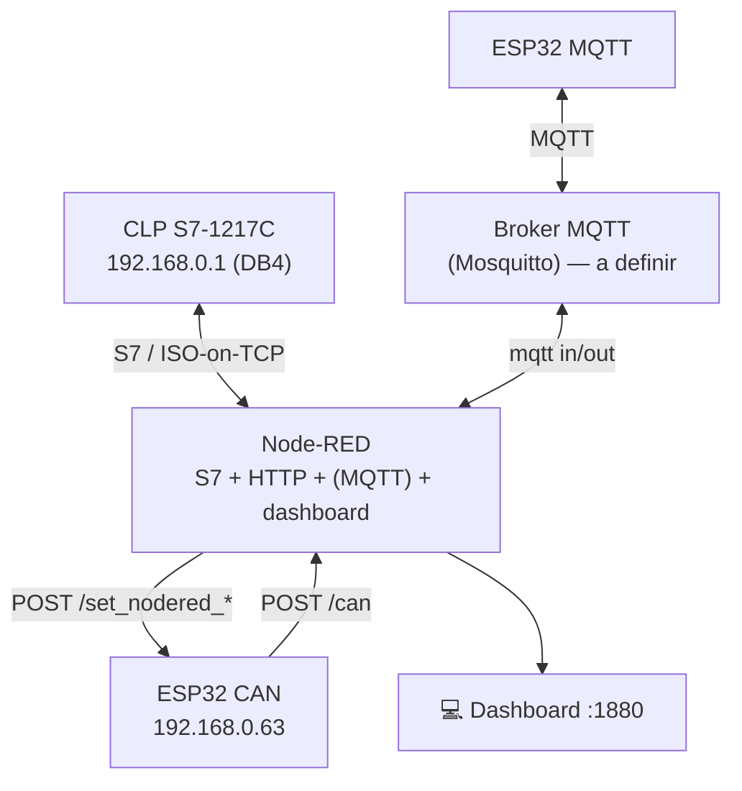

# 🌐 Backbone — Integração (Node-RED como hub multi-protocolo)

[](https://nodered.org/)
[](#)
[](#)
[](#)

O backbone é a **espinha dorsal Ethernet**. Na prática, o **Node-RED** funciona como um **gateway que fala três protocolos ao mesmo tempo**, um para cada célula — em vez de forçar todas a usarem MQTT. Isso é válido pelo enunciado ("mapear seus dados para um servidor central") e é um padrão real de integração.

| Célula | Protocolo até o backbone | Nó Node-RED |
|:------:|--------------------------|-------------|
| 1 — PROFINET | **S7 / ISO-on-TCP** (CLP) | `node-red-contrib-s7` |
| 2 — CAN | **HTTP REST** (ESP32) | `http in` / `http request` |
| 3 — MQTT | **MQTT** (ESP32) | `mqtt in` / `mqtt out` *(a adicionar)* |

> 💡 **Trade-off (S7/HTTP × MQTT):** o esquema atual funciona e é simples de depurar. Porém HTTP é *request/response* (precisa de polling para ter telemetria contínua) e o S7 lê por *cycletime*; já o MQTT é *push* assíncrono (menor latência e overhead em telemetria). Para a banca, vale citar os dois lados — ver [`docs/mapeamento-osi.md`](../docs/mapeamento-osi.md).

---

## 1. O que o flow `flows-backbone.json` faz

### Conexão PROFINET (CLP)
- **S7 endpoint** `S71217C` em `192.168.0.1` (rack 0 / slot 1, ISO-on-TCP, cycletime 1000 ms).
- Variáveis no **DB4** (controle do inversor SINAMICS):

| Nome | Endereço | Tipo | Uso |
|------|----------|------|-----|
| `START` | `DB4.DBX0.0` | bool | Liga o inversor |
| `STOP` | `DB4.DBX.0.1` ⚠️ | bool | Para o inversor |
| `ENTRADA_REF_FREQUENCIA` | `DB4.DBD10` | dword/real | Referência de frequência (setpoint) |
| `FBK_REF_FREQUENCIA` | `DB4.DBD14` | dword/real | Feedback de frequência |

> ⚠️ **Bug provável:** o endereço de `STOP` está escrito **`DB4.DBX.0.1`** (ponto a mais). O correto é **`DB4.DBX0.1`**. Do jeito que está, o nó S7 não resolve o endereço.

### Integração CAN (HTTP)
- `POST /can` → recebe dados do ESP32 CAN.
- `POST /toggle` → liga/desliga o inversor (botões Liga/Desliga do dashboard).
- `POST /slider` → ajuste de frequência/velocidade.
- `http request` → envia para o ESP32 CAN (`192.168.0.63`): `/set_nodered_freq`, `/set_nodered_value`.

### Dashboard (node-red-dashboard)
- Páginas: **Home**, **CLP**, **CAN**.
- Widgets: LED "Inversor Liga/Desliga Via Esp32", gauge **Km/h** (0–100), sliders de velocidade/frequência (0–60 e 0–100), botões **Liga/Desliga**.

## 2. `flows-web-bridge.json` (HTTP MCU ⇄ Web)

Flow de referência que serve uma página em `GET /site` e expõe:
- `GET /api/state` (estado atual: temperatura, umidade, luz, atuador),
- `POST /api/actuator` (site comanda atuador),
- `POST /api/mcu/sensor` (MCU envia sensor e recebe o comando na mesma resposta).

Útil como **template de integração HTTP** e como página web exigida ("comunicar com o website online").

---

## 3. Diagrama de integração (real)



---

## 4. Conteúdo desta pasta

```text
backbone/
├── README.md
├── node-red/
│   ├── flows-backbone.json     ← S7 (PROFINET) + HTTP (CAN) + dashboard
│   └── flows-web-bridge.json   ← demo HTTP MCU ⇄ Web
├── diagramas/
├── componentes/
└── figs/
```

> ⚠️ **Segurança:** revise os flows antes de commitar — remova IPs sensíveis se necessário e **nunca** versione senhas de broker.
