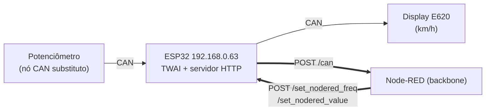
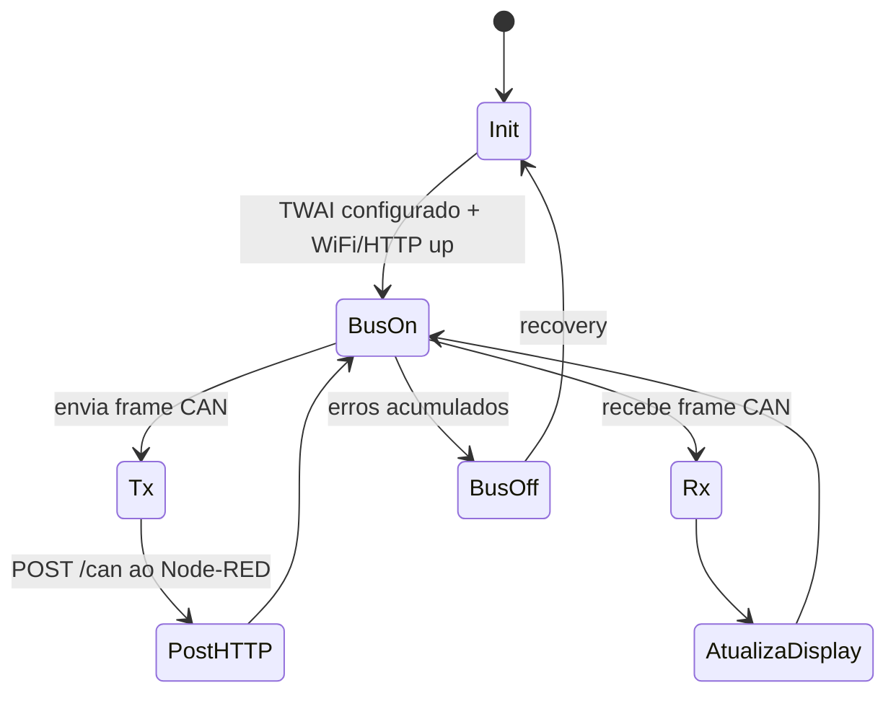

# 🟩 Rede CAN — Célula 2 (Álvaro & Alexandre)

[](https://www.csselectronics.com/pages/can-bus-simple-intro-tutorial)
[](#)
[](#)

Célula que usa **CAN** localmente e **HTTP REST** para falar com o backbone (Node-RED). O sensor CAN é um **nó ESP32 substituto** (potenciômetro), e o atuador é o **Display Dashboard E620** (kit automotivo — daí o gauge de **km/h** no dashboard).

> 🧩 Template — a Dupla 2 preenche o que falta. O lado do **backbone** (Node-RED) já está documentado a partir do flow real.

---

## 1. Descrição e integração real

O ESP32 da célula CAN está em **`192.168.0.63`** e troca dados com o Node-RED por **HTTP**:

| Direção | Quem chama | Endpoint | Conteúdo |
|---------|-----------|----------|----------|
| CAN → backbone | ESP32 → Node-RED | `POST /can` | leitura do nó CAN (ex. velocidade) |
| backbone → CAN | Node-RED → ESP32 | `POST http://192.168.0.63/set_nodered_freq` | frequência/velocidade alvo |
| backbone → CAN | Node-RED → ESP32 | `POST http://192.168.0.63/set_nodered_value` | valor genérico |

| Item | Valor |
|------|-------|
| Controlador | **ESP32** (periférico TWAI/CAN) |
| Sensor | Potenciômetro lido por nó ESP32 (substituto CAN) |
| Atuador | **Display Dashboard E620** (lab. EMOL/IFSC) |
| Transceiver CAN | _preencher_ (ex. SN65HVD230) |
| Bridge backbone | **HTTP REST** (não MQTT) |

---

## 2. Diagrama de blocos



> ⚠️ Transceiver CAN (ex. SN65HVD230) é **obrigatório** — o ESP32 só tem o controlador lógico (TWAI), não o driver de barramento. Terminação **120 Ω** nas duas pontas.

---

## 3. Máquina de estados (preencher)



---

## 4. Conteúdo desta pasta

```text
rede-can/
├── README.md
├── firmware/     ← código do ESP32 (TWAI + servidor HTTP)  [a versionar]
├── diagramas/
├── componentes/
└── figs/
```

> O **flow do Node-RED** que recebe o `POST /can` e envia comandos está em
> [`backbone/node-red/flows-backbone.json`](../backbone/node-red/flows-backbone.json).
