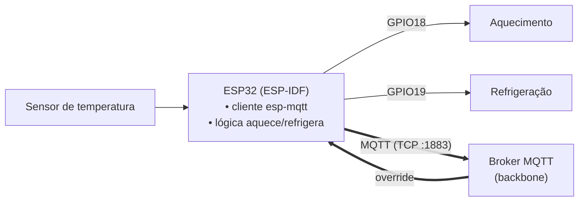
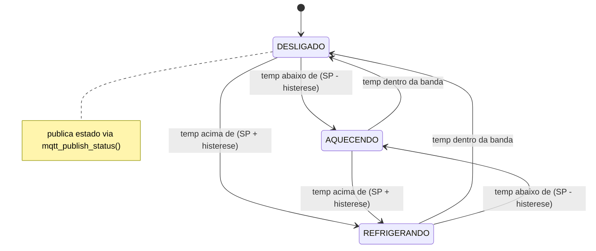
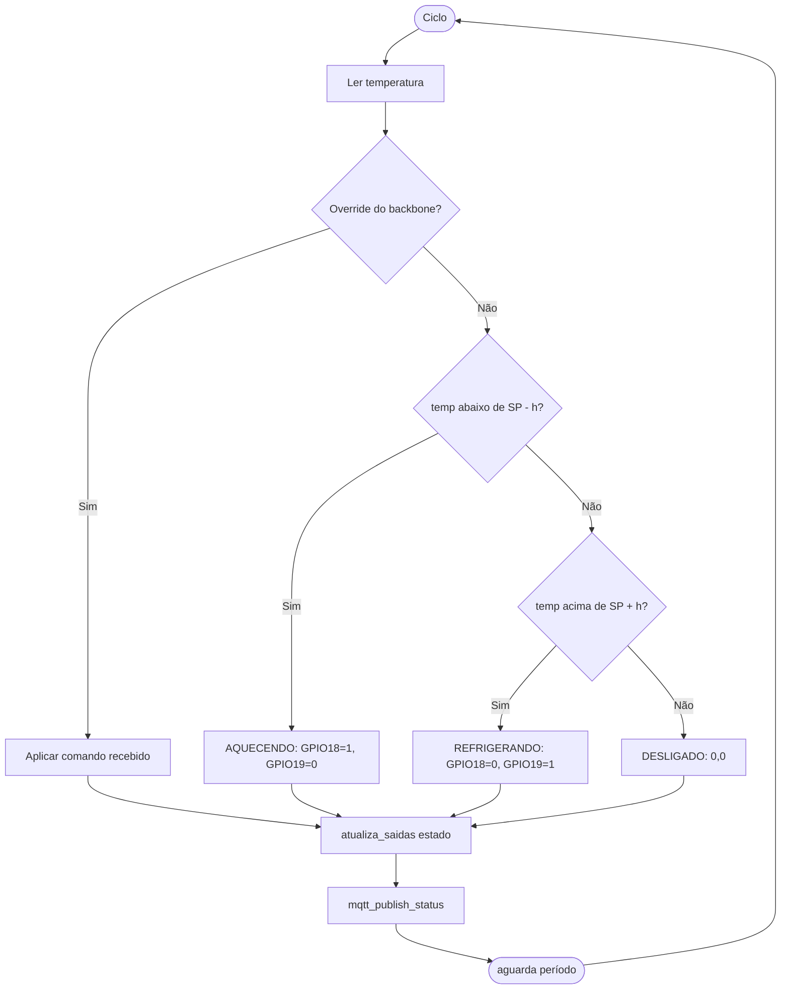

# 🟧 Rede MQTT — Célula 3 (Lucas & Henzo)

[](https://mqtt.org/)
[](#)
[-yellow.svg)](https://platformio.org/)

Célula de produção que usa **MQTT** como protocolo. Um **ESP32** (ESP-IDF) atua como **cliente MQTT**: publica o estado do processo e recebe comandos. O segundo **ESP32** é responsávelpor controlar o **sensor térmico** — o atuador tem um canal de **aquecimento** e um de **refrigeração**.

---

## 1. Descrição do projeto

O ESP32 lê a temperatura do processo, decide localmente o estado (desligado / aquecendo / refrigerando) e aciona as saídas correspondentes. Em paralelo, publica o estado via MQTT e pode receber comandos/override do backbone.

| Item | Descrição |
|------|-------|
| Controlador | **ESP32** (`esp32doit-devkit-v1`) |
| Framework | **ESP-IDF** (`espressif32@6.5.0`, IDF 5.1.x) via PlatformIO |
| Cliente MQTT | `esp-mqtt` (nativo do ESP-IDF) |
| Atuador | Aquecimento (**GPIO18**) + Refrigeração (**GPIO19**) |
| Sensor | Temperatura *DS18B20* |

### Estados do sistema (do firmware)

| Estado (`estado_sistema_t` / `acionamento_sistema_t`) | GPIO18 (aquec.) | GPIO19 (refrig.) |
|---|:---:|:---:|
| `DESLIGADO` | 0 | 0 |
| `AQUECENDO` | 1 | 0 |
| `REFRIGERANDO` | 0 | 1 |

> ⚙️ **Autonomia:** a decisão `aquecer / refrigerar / desligar` deve rodar **no ESP32**, não no Node-RED. O backbone serve para monitorar e sobreescrever. 

---

## 2. Diagrama de blocos da célula



---

## 3. Máquina de estados



---

## 4. Fluxograma da lógica de controle



---

## 5. Diagrama elétrico / ligações

| Saída | GPIO | Função | Observação |
|-------|:----:|--------|------------|
| Aquecimento | **GPIO18** | Liga elemento de aquecimento (via relé) | Relé/SSR; carga em fonte separada |
| Refrigeração | **GPIO19** | Liga ventilador/peltier (via relé) | GND comum com o ESP |
| Sensor temp | _definir_ | Entrada do sensor | Se DS18B20: pull-up 4k7 no 1-Wire |

> Esquemático formal → exportar de Fritzing/KiCad para `figs/`.

---

## 6. Firmware

```text
firmware/esp32-idf/
├── platformio.ini                 ← env esp32doit-devkit-v1, framework = espidf
├── CMakeLists.txt                 ← projeto ESP32_act
├── sdkconfig.esp32doit-devkit-v1
├── .gitignore                     ← ignora .pio, build/ e SEGREDOS
├── .vscode/                       ← extensions.json, settings.json
└── main/
    ├── wifi.h                     ← SANITIZADO (inclui wifi_secrets.h)
    ├── wifi_secrets.example.h     ← template (copie p/ wifi_secrets.h)
    ├── mqtt_app.h                 ← estados + mqtt_start()/mqtt_publish_status()
    └── atuador.h                  ← GPIO18/19 + atualiza_saidas()
```

> 🔐 **Antes do primeiro build:** `cp main/wifi_secrets.example.h main/wifi_secrets.h` e preencha SSID/senha. Esse arquivo está no `.gitignore`.

### Versões

| Software | Versão |
|----------|--------|
| PlatformIO platform `espressif32` | **6.5.0** (ESP-IDF 5.1.x) |
| Framework | ESP-IDF (`espidf`) |
| Board | `esp32doit-devkit-v1` |

---

## 7. Pendências (o que falta versionar)

- [ ] Endereço do **broker** e **tópicos** usados no `mqtt_app.c`

---

## 8. Conteúdo desta pasta

```text
rede-mqtt/
├── README.md
├── diagramas/    ← exports dos diagramas
├── componentes/  ← lista de componentes, datasheets
├── figs/         ← fotos da bancada
└── firmware/esp32-idf/  ← projeto ESP-IDF
```
