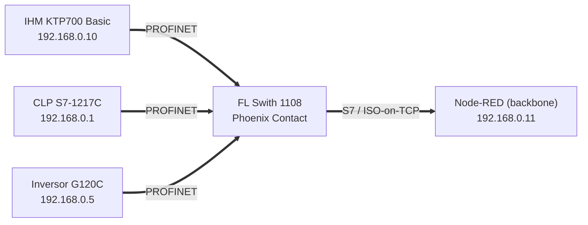
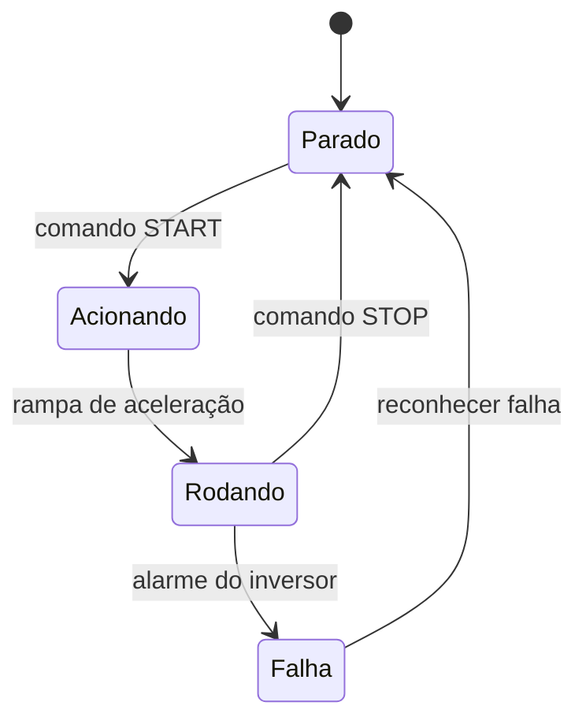

# 🟦 Rede PROFINET — Célula 1 (Cainã & Matheus)

[](https://www.profibus.com/)
[](#)

---

## 1. Descrição do projeto

O protocolo local utilizado é o **PROFINET**, com um CLP s7 1217C usado como mestre da rede, uma IHM operando como sensor e tela de visualização e um Inversor de Frequência, atuando como um atuador final. O CLP também atua como **bridge** para o backbone (node-red) via protocolo **S7 / ISO‑on‑TCP**, um protocolo nativo do proprio CLP. 

A ideia dentro desta rede é de controlar um motor de 380V e 2cv de potencia atraves de um inversor de frequencia, para isso sera usado a IHM para definir a frequencia, ligar e desligar o motor. Toda a comunicação dentro desta rede independe do backbone, podendo funcionar de forma offline. O grande diferencial desta abordagem é poder conectar dois mundos aparentemente distantes: um motor de alta potencia e um Dashboard altamente tecnologico e moderno.  

| Item | Valor |
|------|-------|
| Controlador | **CLP Siemens S7‑1217 C** (endpoint `192.168.0.1`, rack 0 / slot 1) |
| Sensor / IHM | **IHM KTP700 Basic** (endpoint `192.168.0.10`) |
| Atuador | **Inversor de frequência SINAMICS G120C** (endpoint `192.168.0.5`) |
| Bridge backbone | **S7 / ISO‑on‑TCP** via `node‑red‑contrib‑s7` (cycletime 1000 ms) |
| Software | TIA Portal _(versão: V20)_ |

### Variáveis Disponiveis ao Node-RED

| Nome | Endereço | Tipo | Uso |
|------|----------|------|-----|
| `START` | `DB4.DBX0.0` | bool | Liga o inversor |
| `STOP` | `DB4.DBX0.1` | bool | Desliga o inversor |
| `ENTRADA_REF_FREQUENCIA` | `DB4,REAL2` | real | Seta frequência |
| `FDK_HZ` | `DB2,REAL6` | real | Feedback de frequência |
| `RESET_INV` | `DB4,x0.2` | bool | Reseta as falhas no inversor de frequência |
| `HABILITA NODE RED` | `DB2,X10.1` | bool | Habilita o comando via node red |
| `FDK_VEL` | `DB6,REAL4` | real | Feedback da velocidade rede can |
| `SET_VEL` | `DB6,REAL0` | real | Seta o valor da velocidade rede can |
| `Liga_AQ` | `DB7,X0.0` | bool | Liga o Aquecedor rede MQTT |
| `Liga_Vent` | `DB7,X0.1` | bool | Liga o Ventilador rede MQTT |
| `Desliga_Vent_AQ` | `DB7,X0.2` | bool | Desliga o Ventilador ou o Aquecedor rede MQTT |
| `FDK_temp` | `DB7,REAL2` | real | Feedback do valor da temperatura rede MQTT |


---

## 2. Diagrama de blocos



---

## 3. Diagrama de Estados 


---
## 4. Diagrama de Sequência

desenvolver
---

## 5. Componentes e Modelos


### Componentes — Rede PROFINET

| Componente | Especificação | Fornecedor| Link |
|-----------|---------------|:---:|----------------|
| CLP Siemens S7-1217C | CPU 1217C DC/DC/DC | Siemens  |<a href="https://www.mercadolivre.com.br/clp-siemens-cpu1217c-dcdcdc-6es7-2171ag400xb0-s71200/up/MLBU3687628652?pdp_filters=item_id%3AMLB6067313602&from=gshop&matt_tool=59586449&matt_word=&matt_source=google&matt_campaign_id=22120855419&matt_ad_group_id=179138688171&matt_match_type=&matt_network=g&matt_device=c&matt_creative=729092955262&matt_keyword=&matt_ad_position=&matt_ad_type=pla&matt_merchant_id=463061090&matt_product_id=MLBU3687628652&matt_product_partition_id=2391408921319&matt_target_id=pla-2391408921319&cq_src=google_ads&cq_cmp=22120855419&cq_net=g&cq_plt=gp&cq_med=pla&gad_source=1&gad_campaignid=22120855419&gbraid=0AAAAAD93qcC-vFAzmTlMO4eXjA2yH04be&gclid=Cj0KCQjwr4jSBhCSARIsAOX1E-LskTHhsEsUYxt1abX5UpLJKIB4Qt8gBJ08Qnp1oUG8r6bVNgvKWEkaAhdOEALw_wcB" target="_blank">Link</a>| 
| IHM KTP700 Basic | HMI 7" |  Siemens |<a href="https://www.mercadolivre.com.br/ihm-siemens-ktp700-basic-6av21232gb030ax0-nova/up/MLBU1754608387?pdp_filters=item_id%3AMLB3699801806&from=gshop&matt_tool=35963832&matt_word=&matt_source=google&matt_campaign_id=22090193654&matt_ad_group_id=174661932924&matt_match_type=&matt_network=g&matt_device=c&matt_creative=727914177760&matt_keyword=&matt_ad_position=&matt_ad_type=pla&matt_merchant_id=5678717624&matt_product_id=MLBU1754608387&matt_product_partition_id=2389866685188&matt_target_id=pla-2389866685188&cq_src=google_ads&cq_cmp=22090193654&cq_net=g&cq_plt=gp&cq_med=pla&gad_source=1&gad_campaignid=22090193654&gbraid=0AAAAAD93qcBA6YeC6NhF5lCo67H0xXuKx&gclid=Cj0KCQjwr4jSBhCSARIsAOX1E-IrfxbxojItCajlbwRjY_jW8jaHDfC_f4qBHDq-mUOMMTpIZJivrAIaAjdXEALw_wcB" target="_blank">Link</a>| 
| Inversor SINAMICS G120C |0,55kW a 132kW (0,75CV a 150CV)| Siemens |<a href="https://www.dimensional.com.br/inversor-trifasico-380-480v-4-1a-2-2kw-sinamics-g120c-6sl32101ke158uf2-siemens/p" target="_blank">Link</a>| 
| Cabo PROFINET (RJ45) | — | | |
| FL Switch 1000 |10/100/1000 MBit/s | Phoenix Contact | | <a href="https://www.mercadolivre.com.br/switch-ethernet-industrial-8-portas-rj-45-phoenix-contact-100mbs/p/MLB22766483#polycard_client=search-desktop&be_origin=backend&search_layout=grid&position=10&type=product&tracking_id=efb02124-a3e4-4a02-90ae-1a1b275c851e&wid=MLB5157563910&sid=search" target="_blank">Link</a>| 
| Gabinete Para quadro Elétrico | 50x40x25cm | -|
| Proteção de curto circuito e sobre carga | Disjuntores trifásico 10A curva C  | -| |
| Fonte de alimentação | 24V VCC 2,5A  | EATON|<a href="" target="_blank">Link</a> |
---

## 5. Conteúdo desta pasta

```text
rede-profinet/
├── README.md
├── projeto-tia/   ← projeto TIA Portal exportado (.zap / .ap)
├── diagramas/     ← blocos, ladder/FBD, rede PROFINET
├── componentes/   ← S7-1214C, KTP700, G120C (datasheets/links)
└── figs/          ← fotos da bancada, telas da IHM
```
