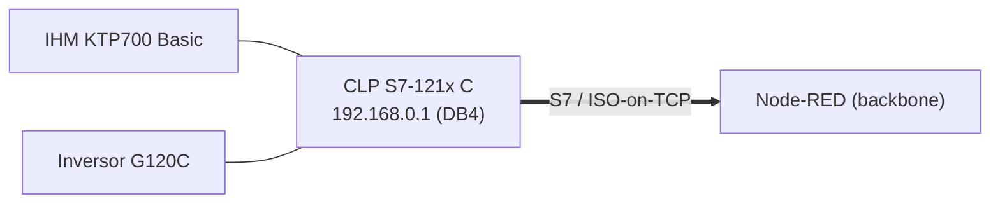
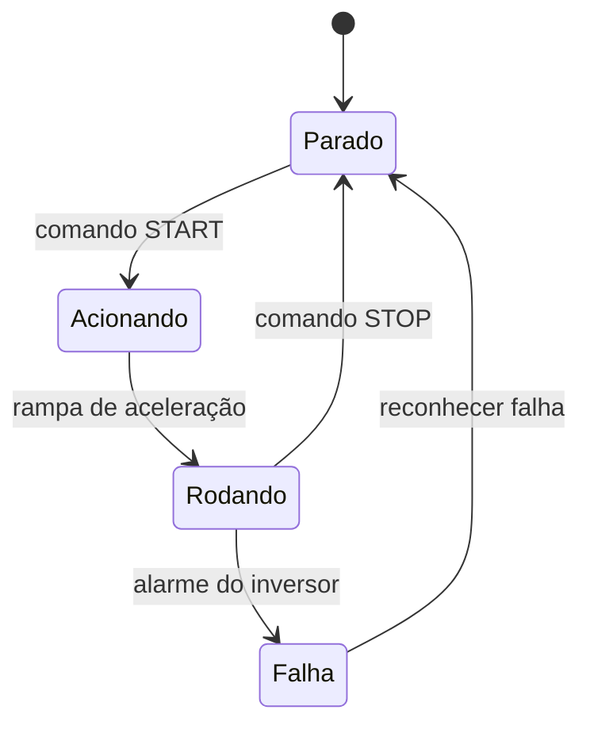

# 🟦 Rede PROFINET — Célula 1 (Cainã & Matheus)

[](https://www.profibus.com/)
[](#)

> 🧩 **Template** — preencher com as informações da Dupla 1. As partes conhecidas já estão pré‑preenchidas.

---

## 1. Descrição do projeto

Célula que usa **PROFINET** (Ethernet industrial, baseado em Ethernet/IP padrão) como protocolo local, com um CLP Siemens como mestre. O CLP atua também como **bridge** para o backbone — PROFINET já é Ethernet, então o "subir para o nível Ethernet" se dá expondo as variáveis via **OPC UA** (servidor nativo do S7‑1200, firmware ≥ 4.4) ou **MQTT** (biblioteca LMQTT/`MqttClient` no TIA Portal).

| Item | Valor |
|------|-------|
| Controlador | CLP Siemens **S7‑121x C** (endpoint `192.168.0.1`, rack 0 / slot 1) |
| Sensor / IHM | **IHM KTP700 Basic** (HMI) |
| Atuador | **Inversor de frequência SINAMICS G120C** |
| Bridge backbone | **S7 / ISO‑on‑TCP** via `node‑red‑contrib‑s7` (cycletime 1000 ms) |
| Ambiente | TIA Portal _(versão: preencher — ex. V17/V18)_ |

### Variáveis expostas ao Node-RED (DB4)

| Nome | Endereço | Tipo | Uso |
|------|----------|------|-----|
| `START` | `DB4.DBX0.0` | bool | Liga o inversor |
| `STOP` | `DB4.DBX0.1` | bool | Para o inversor |
| `ENTRADA_REF_FREQUENCIA` | `DB4.DBD10` | dword/real | Referência de frequência |
| `FBK_REF_FREQUENCIA` | `DB4.DBD14` | dword/real | Feedback de frequência |

> ⚠️ No flow atual, o endereço de `STOP` aparece como **`DB4.DBX.0.1`** (ponto extra) — corrigir para **`DB4.DBX0.1`**, senão o nó S7 não resolve.

---

## 2. Diagrama de blocos



> ⚠️ **Nota técnica:** o documento original do grupo afirma que esta célula "utiliza o protocolo MQTT". Isso é um erro de copiar‑colar — o protocolo **local** é **PROFINET**, e a ponte ao Node-RED é via **protocolo S7 (ISO-on-TCP)**, não MQTT.

---

## 3. Sequência / estados (preencher)



---

## 4. Componentes e versões

Ver [`componentes/README.md`](componentes/README.md). Tabela de versões em construção (TIA Portal, firmware do CLP, GSDML do G120C).

---

## 5. Conteúdo desta pasta

```text
rede-profinet/
├── README.md
├── projeto-tia/   ← projeto TIA Portal exportado (.zap / .ap)
├── diagramas/     ← blocos, ladder/FBD, rede PROFINET
├── componentes/   ← S7-1214C, KTP700, G120C (datasheets/links)
└── figs/          ← fotos da bancada, telas da IHM
```
