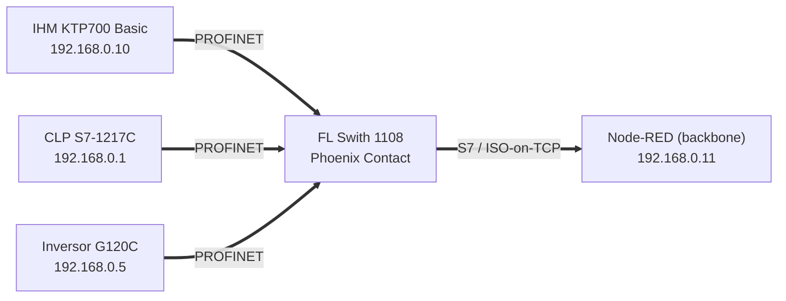
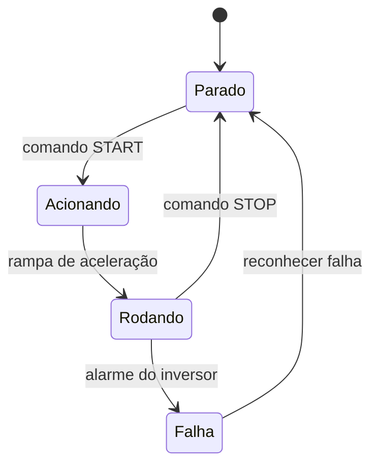

# 🟦 Rede PROFINET — Célula 1 (Cainã & Matheus)

[](https://www.profibus.com/)
[](#)

---

## 1. Descrição do projeto

O protocolo local utilizado é o **PROFINET**, com um CLP s7 1217C operando como mestre da rede, uma IHM operando como sensor e tela de visualização e um Inversor de Frequência, atuando como um atuador final. O CLP também atua como **bridge** para o backbone (node-red) via protocolo **S7 / ISO‑on‑TCP**, um protocolo nativo do proprio CLP. 

A ideia dentro desta rede é de controlar um motor de 380V e 2cv de potencia atraves de um inversor de frequencia, para isso sera usado a IHM para definir a frequencia, ligar e desligar o motor. Toda a comunicação dentro desta rede independe do backbone, podendo funcionar de forma offline. O grande diferencial desta abordagem é poder conectar dois mundos aparentemente distantes: um motor de alta potencia e um Dashboard altamente tecnologico e moderno.  

| Item | Valor |
|------|-------|
| Controlador | **CLP Siemens S7‑1217 C** (endpoint `192.168.0.1`, rack 0 / slot 1) |
| Sensor / IHM | **IHM KTP700 Basic** (endpoint `192.168.0.10`) |
| Atuador | **Inversor de frequência SINAMICS G120C** (endpoint `192.168.0.5`) |
| Bridge backbone | **S7 / ISO‑on‑TCP** via `node‑red‑contrib‑s7` (cycletime 1000 ms) |
| Software | TIA Portal _(versão: V20)_ |

### Variáveis Disponiveis ao Node-RED

| Nome | Endereço | Tipo | Uso |
|------|----------|------|-----|
| `START` | `DB4.DBX0.0` | bool | Liga o inversor |
| `STOP` | `DB4.DBX0.1` | bool | Desliga o inversor |
| `ENTRADA_REF_FREQUENCIA` | `DB4,REAL2` | real | Seta frequência |
| `FDK_HZ` | `DB2,REAL6` | real | Feedback de frequência |
| `RESET_INV` | `DB4,x0.2` | bool | Reseta as falhas no inversor de frequência |
| `HABILITA NODE RED` | `DB2,X10.1` | bool | Habilita o comando via node red |
| `FDK_VEL` | `DB6,REAL4` | real | Feedback da velocidade rede can |
| `SET_VEL` | `DB6,REAL0` | real | Seta o valor da velocidade rede can |
| `Liga_AQ` | `DB7,X0.0` | bool | Liga o Aquecedor rede MQTT |
| `Liga_Vent` | `DB7,X0.1` | bool | Liga o Ventilador rede MQTT |
| `Desliga_Vent_AQ` | `DB7,X0.2` | bool | Desliga o Ventilador ou o Aquecedor rede MQTT |
| `FDK_temp` | `DB7,REAL2` | real | Feedback do valor da temperatura rede MQTT |


---

## 2. Diagrama de blocos



---

## 3. Diagrama de Estados 


---
## 4. Diagrama de Sequência

desenvolver
---

## 5. Componentes e Modelos


### Componentes — Rede PROFINET

| Componente | Especificação | Qtd | Datasheet/Link |
|-----------|---------------|:---:|----------------|
| CLP Siemens S7-1217C | CPU 1217C DC/DC/DC | 1 | Siemens Support |
| IHM KTP700 Basic | HMI 7" | 1 | Siemens Support |
| Inversor SINAMICS G120C |0,55kW a 132kW (0,75CV a 150CV)| 1 | Siemens Support |
| Cabo PROFINET (RJ45) | — | n | |
| FL Switch 1000 |10/100/1000 MBit/s | 1 |Phoenix Contact |
| Gabinete Para quadro Elétrico | 50x40x25cm | 1 |-|
| Controle de potencia interno | Disjuntores de potência classe C para controle do trifásico e alimentação do CLP | 4 |-|
| Controle de potencia interno |Disjuntor motor  | 1 |-|

---

## 5. Conteúdo desta pasta

```text
rede-profinet/
├── README.md
├── projeto-tia/   ← projeto TIA Portal exportado (.zap / .ap)
├── diagramas/     ← blocos, ladder/FBD, rede PROFINET
├── componentes/   ← S7-1214C, KTP700, G120C (datasheets/links)
└── figs/          ← fotos da bancada, telas da IHM
```
