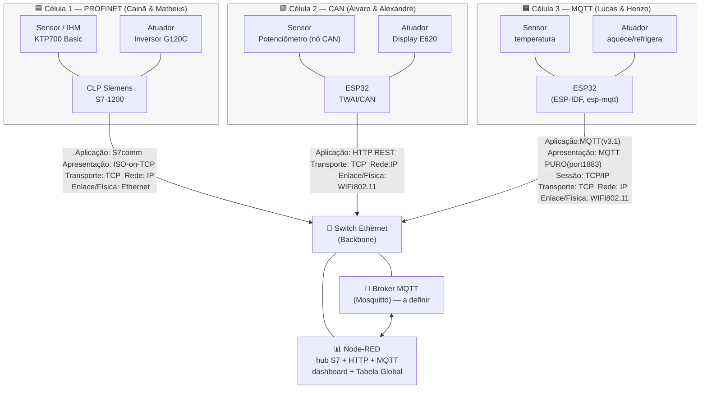

<div align="center">

# 🛰️ NEXUS — Sistema de Automação de Multiredes

**Backbone Ethernet integrando três células de produção com protocolos industriais distintos**

[](#)
[](https://www.ifsc.edu.br/)
[](#)
[](#)
[](#)
[](#)
[](LICENSE)

</div>

---

## 1. Contexto

Projeto final da disciplina de **Comunicação de Dados** (IFSC — Departamento Acadêmico de Eletrônica). O objetivo é a **construção coletiva de um sistema de automação heterogêneo**: três duplas, três protocolos distintos, **uma única rede integrada**.

O critério central é a **interoperabilidade**: ao final, *o status de qualquer sensor da sala deve poder ser lido por qualquer célula, e qualquer atuador deve poder ser comandado, independentemente da rede em que esteja fisicamente conectado.*

| Item | Descrição |
|------|-------|
| Instituição | IFSC — Departamento Acadêmico de Eletrônica |
| Disciplina | Comunicação de Dados |
| Integrantes | Matheus e Cainã, Álvaro e Alexandre, Henzo e Lucas |
| Integração | Backbone Ethernet + Broker MQTT central (Node-RED) |


---

## 2. Descrição geral

O sistema é dividido em **três células de produção**, cada uma com três nós, construído por uma dupla e operando um **protocolo industrial diferente** na camada local. Cada nó é responsável por:

1. **Autonomia local** — ler o próprio sensor e comandar o próprio atuador *sem depender da rede externa*.
2. **Visibilidade global** — espelhar suas variáveis no backbone para que as outras células leiam/escrevam.
3. **Diagnóstico** — publicar um bit de presença (online/offline) no backbone.

A "língua geral" que une as três redes é o **MQTT sobre TCP/IP**, agregado por um **broker central** e visualizado/orquestrado por um **dashboard Node-RED**. Redes que não falam MQTT nativamente (PROFINET, CAN) usam um **gateway/bridge** no próprio controlador para "subir" os dados ao nível Ethernet.

> 📌 **Sobre o transporte do backbone:** o diagrama original indicava `http` entre os nós e o "Servidor de Controle" — e isso **está correto para parte do sistema**. O Node-RED age como **hub multi-protocolo**: fala **S7/ISO-on-TCP** com o CLP (PROFINET), **HTTP REST** com o ESP32 da célula CAN, e **MQTT** com o ESP32 da célula MQTT. A "língua geral" não é um protocolo único no fio — é a **Tabela Global de Variáveis** consolidada dentro do Node-RED. Comparação dos transportes em [`docs/mapeamento-osi.md`](docs/mapeamento-osi.md).

---

## 3. As três células (introdução)

| Dupla | Protocolo local | Controlador | Sensor | Atuador | Bridge p/ backbone |
|:-----:|:----------------|:------------|:-------|:--------|:-------------------|
| **1** — Cainã & Matheus | **PROFINET** | CLP Siemens S7‑121xC (`192.168.0.1`) | IHM KTP700 Basic | Inversor SINAMICS G120C | **S7 / ISO‑on‑TCP** (node‑red‑contrib‑s7) |
| **2** — Álvaro & Alexandre | **CAN** | ESP32 TWAI (`192.168.0.63`) | Potenciômetro (nó CAN substituto) | Display Dashboard E620 | **HTTP REST** (`/can`, `/set_nodered_*`) |
| **3** — Lucas & Henzo | **MQTT** | PC com Mosquitto | Sensor de temperatura com ESP32S3 | Aquecimento + Refrigeração (GPIO18/19) com ESP32S3 | **MQTT** (`esp-mqtt`) |

Cada célula tem sua documentação completa, diagramas e código nas pastas abaixo.

---

## 4. Diagrama de blocos geral do sistema



Cada célula resolve sua automação localmente e sobe seus dados ao **Node-RED**, sendo ele o servidor central pelo protocolo que é própria da célula de produção — **S7** (PROFINET), **HTTP** (CAN) ou **MQTT**. O Node-RED atua como **hub multi-protocolo**, mantém a **Tabela Global de Variáveis** e expõe o **dashboard** de monitoramento e o sobreescreve. A unificação acontece **dentro** do Node-RED.

---

## 5. Sumário / Navegação

### 🌐 Backbone e integração
- 📁 [**Backbone (Node-RED + Broker)**](backbone/README.md) — switch, broker MQTT, dashboard, tabela global
- 📄 [Tabela Global de Variáveis](docs/tabela-global-variaveis.md)
- 📄 [Convenção de tópicos MQTT](docs/convencao-topicos-mqtt.md)
- 📄 [Plano de endereçamento IP](docs/enderecamento-ip.md)
- 📄 [Mapeamento OSI dos protocolos](docs/mapeamento-osi.md)

### 🏭 Células de produção
- 📁 [**Rede PROFINET**](rede-profinet/README.md) — Dupla 1
- 📁 [**Rede CAN**](rede-can/README.md) — Dupla 2
- 📁 [**Rede MQTT**](rede-mqtt/README.md) — Dupla 3

### 📈 Resultados e referências
- 📄 [Resultados (tempo, perda de pacotes, jitter, throughput)](docs/resultados.md)
- 📄 [Referências e links úteis](docs/referencias.md)

---

## 6. Como executar (visão rápida)

```text
1. Suba o broker MQTT central (Mosquitto) no notebook da Dupla 1.
2. Inicie o Node-RED e importe o flow de backbone/node-red/flows.json.
3. Conecte os três nós ao switch Ethernet (ver docs/enderecamento-ip.md).
4. Energize cada célula — cada uma deve operar localmente (autonomia).
5. Verifique no dashboard Node-RED a presença dos 3 bits de diagnóstico.
6. Teste a interoperabilidade: leia/escreva variáveis de uma célula a partir de outra.
```

Instruções detalhadas em cada pasta de rede.

---

## 7. Equipe

| Dupla | Integrantes | Responsabilidade |
|:-----:|:------------|:-----------------|
| 1 | Cainã, Matheus | Rede PROFINET + **hospedagem do broker/Node-RED** |
| 2 | Álvaro, Alexandre | Rede CAN |
| 3 | Lucas, Henzo | Rede MQTT |

---

## 8. Licença

Distribuído sob a licença [MIT](LICENSE).
